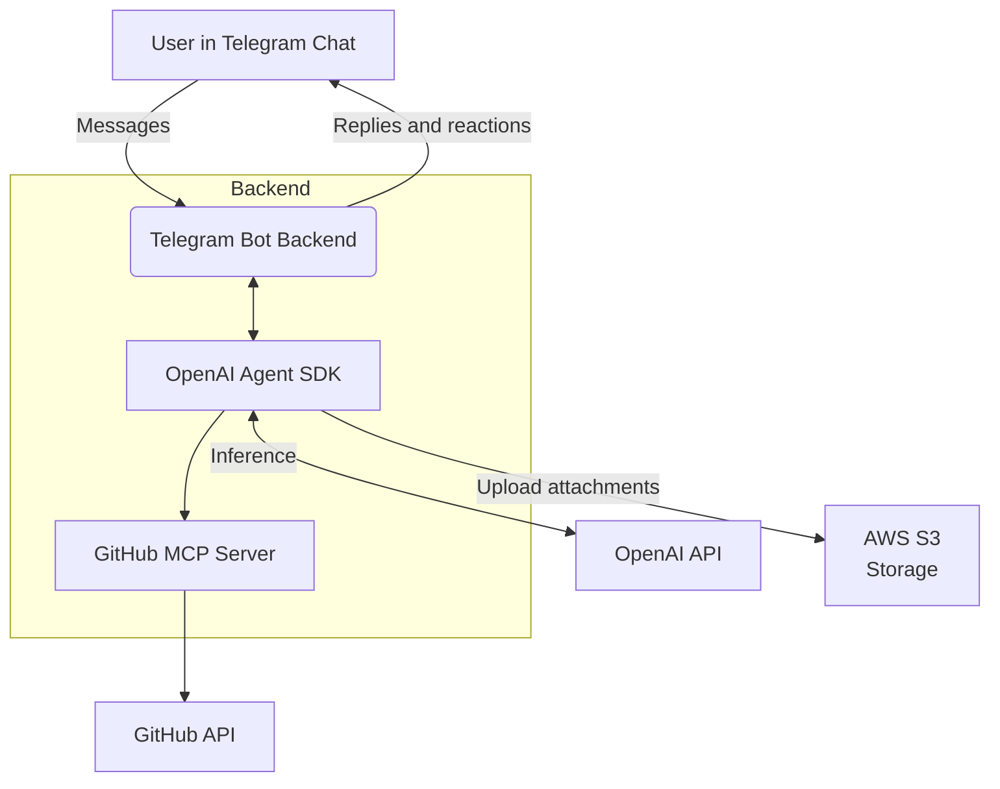

# TeleGit: Telegram—GitHub AI Project Bridge

A minimalist AI-powered Telegram bot that turns simple chat messages into actionable GitHub issues. Using natural language processing (via LLM API), messages are automatically classified, categorized, and synced to GitHub Issues—streamlining idea capture and bug reporting from your team's chat, all with a quick feedback loop.

## Resources

- [Interactive](https://gamma.app/docs/TeleGit-AI-Powered-Project-Management-in-Telegram-i7hfn8yexjw8zhq) or [PDF](https://disk.yandex.ru/i/K6cxHc_LbqZP8Q) presentation
- [Demo video](https://disk.yandex.ru/i/TDxsHprmG1yQtQ)
- [Demo repository](https://github.com/BruiseBane/demo/issues)
- [Demo Telegram bot](https://t.me/my_awesome_chat_gpt_bot)
- [Demo Telegram group](https://t.me/+YrcxXf5it1ZkYWMy)

## History

The project was created from scratch:

- Initialized as empty JavaScript project
- Integrated OpenAI Agent SDK
- Integrated GitHub MCP server
- [Forked](https://github.com/imajus/telegram-bot-mcp-server) the Telegram Bot MCP server and changed it to fit the project needs
- Integrated Handlebars for better LLM prompts management

16\.06 update:

- Introduced automated evaluations support
- Dropped Telegram Bot MCP integration in favour of custom tool

## Architecture



- **OpenAI API:** Handles all messaging/categorization/actioning
- **GitHub MCP Server:** Handles all communication with GitHub Issues
- **Telegram Bot Backend:** Handles progress updates as the AI Agent progresses
- **AWS S3:** Optional storage for image attachments

## Features

- **Chat-first workflow:** Use Telegram group chat as the single entry point for all tasks, ideas, and bug reports.
- **LLM-powered intent extraction:** A message content is analyzed to determine intent and category.
- **Automated GitHub sync:** Manages GitHub issues in your configured repository using GitHub MCP server.
- **AWS S3 Integration:** Optional proxy for message image attachments.

## How It Works

1. Write a message in Telegram group chat mentioning the bot or including an #idea, #bug, #task or #act hashtag.
1. Bot parses and classifies it using an LLM API call.
1. Bot posts the result as a new issue in your GitHub repo (via MCP).
1. Bot indicates the status of his action as a reaction on your message:
   - 👀: Processing
   - 👾: Bug recorded
   - 🫡: Task issued
   - 🦄: Idea logged

### Extra capabilities

TeleGit also can:

- Query existing GitHub issues
- Update or close existing issues
- Attach images from the message to the issue description (S3 integration must be active)

## Development

### Prerequisites

- Node.js >= 22.0.0
- Docker (for running MCP server)
- GitHub Repository
- GitHub Personal Access Token (with issues/pr permissions)
- OpenAI API Key (or your LLM API provider)
- Telegram Bot Token
- AWS S3 Bucket (optional)

### Overview

- All keys are stored as environment variables—**never commit secrets.**
- Project structure:
  - `/backend` - Bot server and core logic
    - `/bot` - Telegram bot handlers
    - `/handlers` - Message and reaction handlers
    - `/services` - External service integrations
  - `/agent` - LLM logic
    - `/agents/mcps` - MCP server definitions
    - `/agents/templates` - LLM prompt templates
    - `/agents/tools` - Custom LLM tools
- Available scripts:
  - `npm start` - Run in production mode
  - `npm run dev` - Run in development mode with hot reload
  - `npm test` - Run evaluations using Vitest
  - `npm run lint` - Run ESLint
  - `npm run lint:fix` - Fix ESLint issues
  - `npm run format` - Format code with Prettier

### Configure and Run the Bot Backend

Set these environment variables:

- `TELEGRAM_BOT_API_TOKEN`
- `OPENAI_API_KEY`
- `GITHUB_REPOSITORY_OWNER` (e.g., `username`)
- `GITHUB_REPOSITORY_NAME` (e.g., `repo`)

Optional environment variables:

- `ALLOWED_TELEGRAM_GROUPS` - Comma separated Telegram group IDs
- `ALLOWED_TELEGRAM_USERS` - Comma separated Telegram user IDs
- `S3_ACCESS_KEY_ID` - For S3 integration
- `S3_SECRET_ACCESS_KEY` - For S3 integration
- `S3_REGION` - For S3 integration
- `S3_BUCKET` - For S3 integration

Then start the backend in development mode:

```bash
# Development mode with hot reload
npm run dev
```

### Running Evaluations

The project includes evaluation capabilities to test the AI agent's performance:

```bash
# Run all evaluations
npm test
```

The evaluation system uses Vitest and Sinon to:

- Create fake GitHub issues and Telegram bots
- Test the agent's ability to process messages and create appropriate GitHub issues
- Validate response accuracy and categorization

### Communicate With Telegram Bot

Add the bot user to your desired Telegram group as admin (for message access and reaction monitoring) or message it directly.

## Docker Deployment

1. Build the Docker image:

```bash
docker build -t telegit:latest .
```

2. Run the container with required environment variables:

```bash
docker run \
  --name telegit \
  -e TELEGRAM_BOT_API_TOKEN=your_telegram_token \
  -e OPENAI_API_KEY=your_openai_key \
  -e GITHUB_REPOSITORY_OWNER=username \
  -e GITHUB_REPOSITORY_NAME=yourrepo \
  -e GITHUB_ACCESS_TOKEN=your_github_token \
  telegit:latest
```

Optional environment variables:

```bash
  -e ALLOWED_TELEGRAM_GROUPS=group1,group2 \
  -e ALLOWED_TELEGRAM_USERS=user1,user2 \
  -e S3_ACCESS_KEY_ID=your_s3_key \
  -e S3_SECRET_ACCESS_KEY=your_s3_secret \
  -e S3_REGION=your_s3_region \
  -e S3_BUCKET=your_s3_bucket \
```

## Roadmap

- [ ] Multi-repo and multi-label mapping
- [ ] Enhanced S3 integration with various file attachment types
- [ ] Launch TeleGit as a scalable Software-as-a-Service offering
- [ ] Support for additional PM tools (GitHub Projects, Trello, Notion, Asana) via MCP
- [ ] Introduce custom workflows, advanced analytics, and intelligent summaries

## License

MIT

## Credits

- [GitHub MCP Server](https://github.com/github/github-mcp-server)
- [Telegraf](https://www.npmjs.com/package/telegraf) for the bot API
- [OpenAI Agent SDK](https://github.com/openai/openai-agents-js) for the agentic API
- [Ogon.ai](https://ogon.ai) for the hackathon
