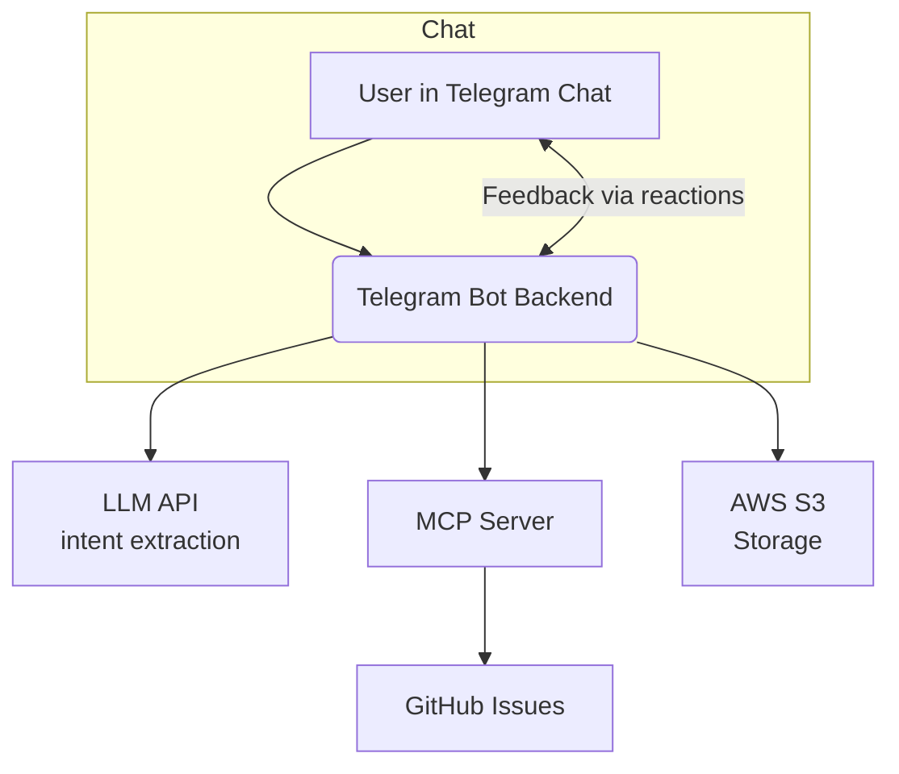

# TeleGit: Telegram—GitHub AI Project Bridge

A minimalist AI-powered Telegram bot that turns simple chat messages into actionable GitHub issues. Using natural language processing (via LLM API), messages are automatically classified, categorized, and synced to GitHub Issues—streamlining idea capture and bug reporting from your team's chat, all with a quick feedback loop.

## Resources

- [Presentation](./presentation.pdf)
- [Demo repository](https://github.com/BruiseBane/demo/issues)
- [Demo Telegram bot](https://t.me/my_awesome_chat_gpt_bot)
- [Demo Telegram group](https://t.me/+YrcxXf5it1ZkYWMy)

## History

The project was created from scratch.

## Architecture



- **LLM API:** Handles all messaging/NLP/categorization
- **MCP Server:** Handles all communication with GitHub Issues
- **AWS S3:** Optional storage for message history and attachments

## Features

- **Chat-first workflow:** Use Telegram group chat as the single entry point for all tasks, ideas, and bug reports.
- **LLM-powered intent extraction:** Any message (with or without hashtags) is analyzed to determine intent and category.
- **Automated GitHub sync:** Manages GitHub issues in your configured repository using GitHub MCP server.
- **User feedback loop:** User approves or rejects AI agent actions via Telegram message reactions; issues are submitted accordingly.
- **AWS S3 Integration:** Optional storage for message history and attachments.

## How It Works

1. Invite the bot to the project group in Telegram and make it an administrator.
1. Write a message in your Telegram team chat mentioning the bot or including an #idea, #bug, #task or #act hashtag.
1. Bot parses and classifies it using an LLM API call (e.g., OpenAI).
1. Bot posts the result as a new issue in your GitHub repo (via MCP).
1. Bot indicates the status of his action as a reaction on your message:
   - 🤔: Processing
   - 👾: Bug recorded
   - 🫡: Task issued
   - 🦄: Idea logged
1. Hashtags are complimentary: LLM handles intent detection from free-form text.

### Extra capabilities

TeleGit also can:

- Query existing GitHub issues
- Update or close existing issues
- Attach images from the message to the issue description (S3 integration must be active)

## Development

### Prerequisites

- Node.js >= 22.0.0
- Docker (for running MCP server)
- GitHub Repository
- GitHub Personal Access Token (with issues/pr permissions)
- OpenAI API Key (or your LLM API provider)
- Telegram Bot Token
- AWS S3 Bucket (optional)

### Overview

- All keys are stored as environment variables—**never commit secrets.**
- Project structure:
  - `/backend` - Bot server and core logic
    - `/bot` - Telegram bot handlers
    - `/handlers` - Message and reaction handlers
    - `/services` - External service integrations
  - `/agent` - LLM logic
    - `/agents/mcps` - MCP server definitions
    - `/agents/templates` - LLM prompt templates
    - `/agents/tools` - Custom LLM tools
- Available scripts:
  - `npm start` - Run in production mode
  - `npm run dev` - Run in development mode with hot reload
  - `npm run lint` - Run ESLint
  - `npm run lint:fix` - Fix ESLint issues
  - `npm run format` - Format code with Prettier

### Configure and Run the Bot Backend

Set these environment variables:

- `TELEGRAM_BOT_API_TOKEN`
- `OPENAI_API_KEY`
- `GITHUB_REPOSITORY_OWNER` (e.g., `username`)
- `GITHUB_REPOSITORY_NAME` (e.g., `repo`)

Optional environment variables:

- `ALLOWED_TELEGRAM_GROUPS` - Comma separated Telegram group IDs
- `ALLOWED_TELEGRAM_USERS` - Comma separated Telegram user IDs
- `S3_ACCESS_KEY_ID` - For S3 integration
- `S3_SECRET_ACCESS_KEY` - For S3 integration
- `S3_REGION` - For S3 integration
- `S3_BUCKET` - For S3 integration

Then start the backend in development mode:

```bash
# Development mode with hot reload
npm run dev
```

### Communicate With Telegram Bot

Add the bot user to your desired Telegram group as admin (for message access and reaction monitoring) or message it directly.

## Docker Deployment

1. Build the Docker image:

```bash
docker build -t telegit:latest .
```

2. Run the container with required environment variables:

```bash
docker run \
  --name telegit \
  -e TELEGRAM_BOT_API_TOKEN=your_telegram_token \
  -e OPENAI_API_KEY=your_openai_key \
  -e GITHUB_REPOSITORY_OWNER=username \
  -e GITHUB_REPOSITORY_NAME=yourrepo \
  -e GITHUB_ACCESS_TOKEN=your_github_token \
  telegit:latest
```

Optional environment variables:

```bash
  -e ALLOWED_TELEGRAM_GROUPS=group1,group2 \
  -e ALLOWED_TELEGRAM_USERS=user1,user2 \
  -e S3_ACCESS_KEY_ID=your_s3_key \
  -e S3_SECRET_ACCESS_KEY=your_s3_secret \
  -e S3_REGION=your_s3_region \
  -e S3_BUCKET=your_s3_bucket \
```

## Roadmap

- [ ] Support for additional PM tools (GitHub Projects, Trello, Notion, Asana) via MCP
- [ ] Multi-repo and multi-label mapping
- [ ] Advanced feedback and auto-summarization
- [ ] User/role-specific filtering and notifications
- [ ] Daily/weekly/monthly performance analytics report
- [ ] Enhanced S3 integration with various file attachment types

## License

MIT

## Credits

- [GitHub MCP Server](https://github.com/github/github-mcp-server)
- [Telegraf](https://www.npmjs.com/package/telegraf) for the bot API
- [OpenAI Agent SDK](https://github.com/openai/openai-agents-js) for the agentic API
- [Ogon.ai](https://ogon.ai) for the hackathon
