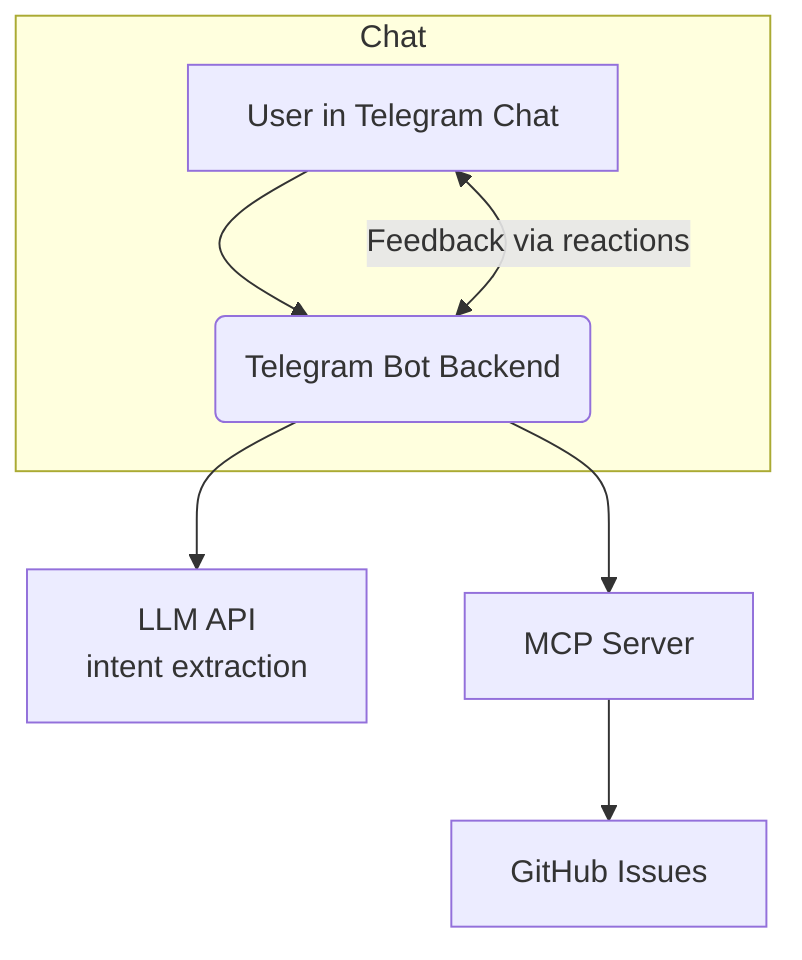

# TeleGit: Telegram—GitHub AI Project Bridge

A minimalist AI-powered Telegram bot that turns simple chat messages into actionable GitHub issues. Using natural language processing (via LLM API), messages are automatically classified, categorized, and synced to GitHub Issues—streamlining idea capture and bug reporting from your team's chat, all with a quick feedback loop.

---

## Features

- **Chat-first workflow:** Use Telegram group chat as the single entry point for all tasks, ideas, and bug reports.
- **LLM-powered intent extraction:** Any message (with or without hashtags) is analyzed to determine intent and category.
- **Automated GitHub sync:** Manages GitHub issues in your configured repository using GitHub MCP server.
- **User feedback loop:** User approves or rejects AI agent actions via Telegram message reactions; issues are submitted accordingly.

---

## How It Works

1. Invite TeleGit bot to your project group in Telegram.
1. Write a message in your Telegram team chat with an idea, bug, or task.
1. Bot parses and classifies it using an LLM API call (e.g., OpenAI).
1. Bot posts the result as a new issue in your GitHub repo (via MCP).
1. Bot indicates the status of his action as a reaction on your message:
   - 🤔: Processing
   - 👾: Bug recorded
   - 🫡: Task updated
   - 🦄: Idea logged
1. User approves or rejects with a simple reaction:
   - 👍: Message is auto-deleted, issue remains on GitHub.
   - 👎: GitHub issue is deleted, and the Bot restarts and try to do it better this time.
   - 💩: Cancel the action and stop Bot from retrying
1. Hashtags are complimentary: LLM handles intent detection from free-form text.

---

## Architecture



- **LLM API:** Handles all messaging/NLP/categorization
- **MCP Server:** Handles all communication with GitHub Issues

---

## Quick Start (PoC / Demo)

### Prerequisites

- Docker (for running MCP server)
- GitHub Repository
- GitHub Personal Access Token (with issues/repo permission)
- OpenAI API Key (or your LLM API provider)
- Telegram Bot Token

### 1. Deploy the MCP Server

```bash
docker run -i --rm \
  -e GITHUB_PERSONAL_ACCESS_TOKEN=your_github_token \
  ghcr.io/github/github-mcp-server
```

Or configure in `mcp.json`:

```json
{
  "servers": {
    "github": {
      "command": "docker",
      "args": [
        "run",
        "-i",
        "--rm",
        "-e",
        "GITHUB_PERSONAL_ACCESS_TOKEN",
        "ghcr.io/github/github-mcp-server"
      ],
      "env": {
        "GITHUB_PERSONAL_ACCESS_TOKEN": "<YOUR_TOKEN>"
      }
    }
  }
}
```

### 2. Configure and Run the Bot Backend

Set these environment variables:

- `TELEGRAM_BOT_TOKEN`
- `OPENAI_API_KEY`
- `MCP_SERVER_HOST` (e.g., `localhost:port`)
- `GITHUB_REPOSITORY` (e.g., `yourorg/yourrepo`)

Also, you may want to set up these optional variables:

- `ALLOWED_TELEGRAM_GROUPS` - Comma separated Telegram group IDs
- `ALLOWED_TELEGRAM_USERS` - Comma separated Telegram user IDs

Then start the backend:

```bash
node server.js
```

### 3. Invite the Bot to Telegram Group

Add the bot user to your desired Telegram group as admin (for message access and reaction monitoring).

---

## Usage

- Just chat as normal (ideas, tasks, bugs).
- Optionally use hashtags; the LLM will infer labels/intent if not present.
- Approve or reject with reactions.
- Stay focused—no context switching, no forms.

---

## Development

- All tokens are stored as environment variables—**never commit secrets.**
- See `/src/backend` for bot and service source code.
- See `/src/llm` for prompt templates and LLM logic.

---

## Roadmap

- [ ] Support for additional PM tools (GitHub Projects, Trello, Notion, Asana) via MCP
- [ ] Multi-repo and multi-label mapping
- [ ] Advanced feedback and auto-summarization
- [ ] User/role-specific filtering and notifications
- [ ] Daily/weekly/monthly performance analytics report

---

## License

MIT

---

## Credits

- [GitHub MCP Server](https://github.com/github/github-mcp-server)
- Telegram for the Bots API
- OpenAI for LLM over API
- [Ogon.ai](https://ogon.ai) for the hackathon
